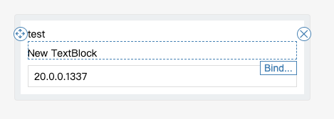
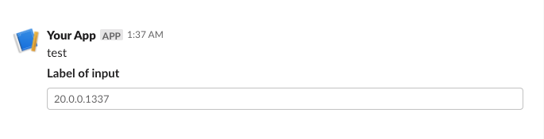

# Resource.yaml

```
components:
  - name: label
    slack: |
      {
        "type": "section",
        "text": {
          "type": "plain_text",
          "text": "${description}",
          "emoji": true
        }
      }
    adaptiveCards: |
      {
          "type": "TextBlock",
          "text": "${description}",
          "wrap": true
      }
  - name: field
    slack: |
      {
        "type": "input",
        "block_id": "input123",
        "label": {
          "type": "plain_text",
          "text": "Label of input"
        },
        "element": {
          "type": "plain_text_input",
          "action_id": "plain_input",
          "placeholder": {
            "type": "plain_text",
            "text": "${value}"
          }
        }
      }
    adaptiveCards: |
      {
          "type": "TextBlock",
          "text": "New TextBlock",
          "wrap": true
      },
      {
          "type": "Input.Text",
          "placeholder": "${placeholder}",
          "value": "${value}"
      }
forms:
  - name: CREATEVM_WIN_STRESSALL_ELEMENTS
    layouts:
    - use: label
      description: test
    - use: field
      name: CREATEVM_WIN_STRESSALL_ELEMENTS
      value: "20.0.0.1337"
      placeholder: "20.0.0.1337"
```

# Adaptive Cards

```
➜ dotnet run
UiType: (1) Slack App UI (2) Adaptive Cards [default=2]:
Form: CREATEVM_WIN_STRESSALL_ELEMENTS
AdaptiveCards
{
  "type": "AdaptiveCard",
  "body": [
    {
      "type": "TextBlock",
      "text": "test",
      "wrap": true
    },
    {
      "type": "TextBlock",
      "text": "New TextBlock",
      "wrap": true
    },
    {
      "type": "Input.Text",
      "placeholder": "20.0.0.1337",
      "value": "20.0.0.1337"
    }
  ]
}
```

Validate by [Adaptive Cards Designer](https://adaptivecards.io/designer/)



# Slack App UI

```
➜ dotnet run
UiType: (1) Slack App UI (2) Adaptive Cards [default=2]: 1
Form: CREATEVM_WIN_STRESSALL_ELEMENTS
SlackAppUI
{
  "blocks": [
    {
      "type": "section",
      "text": {
        "type": "plain_text",
        "text": "test",
        "emoji": true
      }
    },
    {
      "type": "input",
      "block_id": "input123",
      "label": {
        "type": "plain_text",
        "text": "Label of input"
      },
      "element": {
        "type": "plain_text_input",
        "action_id": "plain_input",
        "placeholder": {
          "type": "plain_text",
          "text": "20.0.0.1337"
        }
      }
    }
  ]
}
```

Validate by [Block Kit Builder](https://app.slack.com/block-kit-builder)


