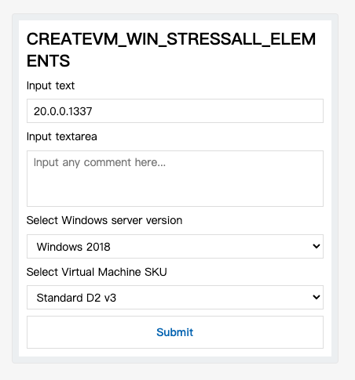

# Resource.yaml

```
components:
  - name: text
    slack: |
      {
        "type": "textarea",
        "name": "${name}",
        "label": "${label}",
        "value": "${value}",
        "hint": "${placeholder}"
      }
    adaptiveCards: |
      {
          "type": "TextBlock",
          "text": "${label}",
          "wrap": true
      },
      {
          "type": "Input.Text",
          "id": "${name}",
          "value": "${value}",
          "placeholder": "${placeholder}"
      }
  - name: textarea
    slack: |
      {
        "type": "text",
        "name": "${name}",
        "label": "${label}",
        "value": "${value}",
        "hint": "${placeholder}"
      }
    adaptiveCards: |
      {
          "type": "TextBlock",
          "text": "${label}",
          "wrap": true
      },
      {
          "type": "Input.Text",
          "isMultiline": true,
          "id": "${name}",
          "value": "${value}",
          "placeholder": "${placeholder}"
      }      
  - name: choose
    slack: |
      {
        "type": "select",
        "name": "${name}",
        "label": "${label}",
        "value": "${value}",
        "options": ${select:options},
        "hint": "${placeholder}"
      }
    adaptiveCards: |
      {
          "type": "TextBlock",
          "text": "${label}",
          "wrap": true
      },
      {
          "type": "Input.ChoiceSet",
          "id": "${name}",
          "value": "${value}",
          "choices": ${select:options},
          "placeholder": "${placeholder}"
      }

forms:
  - name: CREATEVM_WIN_STRESSALL_ELEMENTS
    layouts:
    - use: text
      label: Input text
      name: CREATEVM_WIN_STRESSALL_ELEMENTS
      value: "20.0.0.1337"
      placeholder: "20.0.0.1337"
    - use: textarea
      label: Input textarea
      name: CREATEVM_WIN_STRESSALL_ELEMENTS_1
      value: ""
      placeholder: "Input any comment here..."
    - use: choose
      name: CREATEVM_WIN_STRESSALL_ELEMENTS_2
      label: Select Windows server version
      value: "1"
      placeholder: "Windows ..."
      options:
      - text: Windows 2018
        value: "1"
      - text: Windows 2020
        value: "2"
    - use: choose
      name: CREATEVM_WIN_STRESSALL_ELEMENTS_3
      label: Select Virtual Machine SKU
      value: Standard_D2v3
      placeholder: "Windows ..."
      options:
      - text: Standard D2 v3
        value: Standard_D2v3
      - text: Standard B2ms
        value: Standard_B2ms
```

# Adaptive Cards

```
➜ dotnet run
UiType: (1) Slack App UI (2) Adaptive Cards [default=2]:
Form: CREATEVM_WIN_STRESSALL_ELEMENTS
AdaptiveCards
{
  "type": "AdaptiveCard",
  "body": [
    {
      "type": "TextBlock",
      "text": "CREATEVM_WIN_STRESSALL_ELEMENTS",
      "wrap": true,
      "style": "heading"
    },
    {
      "type": "TextBlock",
      "text": "Input text",
      "wrap": true
    },
    {
      "type": "Input.Text",
      "id": "CREATEVM_WIN_STRESSALL_ELEMENTS",
      "value": "20.0.0.1337",
      "placeholder": "20.0.0.1337"
    },
    {
      "type": "TextBlock",
      "text": "Input textarea",
      "wrap": true
    },
    {
      "type": "Input.Text",
      "isMultiline": true,
      "id": "CREATEVM_WIN_STRESSALL_ELEMENTS_1",
      "value": "",
      "placeholder": "Input any comment here..."
    },
    {
      "type": "TextBlock",
      "text": "Select Windows server version",
      "wrap": true
    },
    {
      "type": "Input.ChoiceSet",
      "id": "CREATEVM_WIN_STRESSALL_ELEMENTS_2",
      "value": "1",
      "choices": [
        {
          "title": "Windows 2018",
          "value": "1"
        },
        {
          "title": "Windows 2020",
          "value": "2"
        }
      ],
      "placeholder": "Windows ..."
    },
    {
      "type": "TextBlock",
      "text": "Select Virtual Machine SKU",
      "wrap": true
    },
    {
      "type": "Input.ChoiceSet",
      "id": "CREATEVM_WIN_STRESSALL_ELEMENTS_3",
      "value": "Standard_D2v3",
      "choices": [
        {
          "title": "Standard D2 v3",
          "value": "Standard_D2v3"
        },
        {
          "title": "Standard B2ms",
          "value": "Standard_B2ms"
        }
      ],
      "placeholder": "Windows ..."
    },
    {
      "type": "ActionSet",
      "actions": [
        {
          "type": "Action.Submit",
          "title": "Submit"
        }
      ]
    }
  ]
}
```

Validate by [Adaptive Cards Designer](https://adaptivecards.io/designer/)



# Slack App UI

```
➜ dotnet run
UiType: (1) Slack App UI (2) Adaptive Cards [default=2]: 1
Form: CREATEVM_WIN_STRESSALL_ELEMENTS
SlackAppUI
{
  "dialog": {
    "title": "CREATEVM_WIN_STRESSALL_ELEMENTS",
    "submit_label": "Submit",
    "callback_id": "",
    "elements": [
      {
        "type": "textarea",
        "name": "CREATEVM_WIN_STRESSALL_ELEMENTS",
        "label": "Input text",
        "value": "20.0.0.1337",
        "hint": "20.0.0.1337"
      },
      {
        "type": "text",
        "name": "CREATEVM_WIN_STRESSALL_ELEMENTS_1",
        "label": "Input textarea",
        "value": "",
        "hint": "Input any comment here..."
      },
      {
        "type": "select",
        "name": "CREATEVM_WIN_STRESSALL_ELEMENTS_2",
        "label": "Select Windows server version",
        "value": "1",
        "options": [
          {
            "label": "Windows 2018",
            "value": "1"
          },
          {
            "label": "Windows 2020",
            "value": "2"
          }
        ],
        "hint": "Windows ..."
      },
      {
        "type": "select",
        "name": "CREATEVM_WIN_STRESSALL_ELEMENTS_3",
        "label": "Select Virtual Machine SKU",
        "value": "Standard_D2v3",
        "options": [
          {
            "label": "Standard D2 v3",
            "value": "Standard_D2v3"
          },
          {
            "label": "Standard B2ms",
            "value": "Standard_B2ms"
          }
        ],
        "hint": "Windows ..."
      }
    ]
  }
}
```

